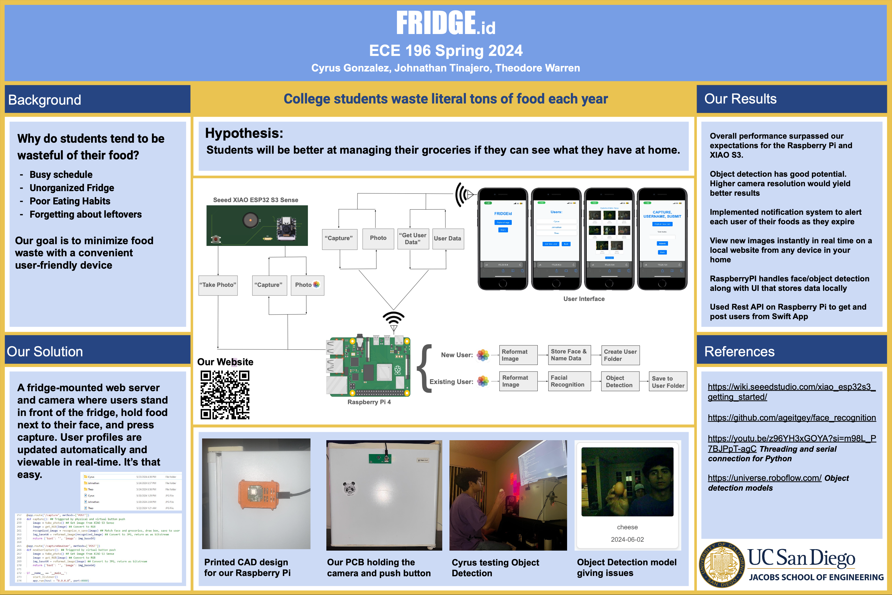

  

# Fridge ID
Fridge ID was an embedded systems project requiring the integration of a custom PCB to solve a specific, modern, problem.  
The problem our team chose to address was that of excessive food waste, especially among undergraduate students who share a small fridge. 

To address this problem, our team created a mountable device that students can place on their fridge to easily catalog their groceries. This device creates and maintains a digital inventory over the web autonomously with the help of facial recognition and object detection.

## Highlights of the Project

### Critical Section Management
    An image capture can be initiated by two threads independently. These two threads both access the same Serial object, which was an oversight that led to many issues throughout development.  
    Once the bug was identified, more issues surfaced regarding the management of the Lock object.  

    A background thread created on boot can write to the Serial port; this thread polls the Serial port waiting for the string "Take_Photo" to arrive. The infinite loop made the management of the Lock more difficult than expected.  

    The main thread can also write to the serial port if a user issues a POST request through a browser. When first testing the system there was no synchronization between the two threads at all, causing undefined behavior at unexpected times.

---

### Serial Communication
Whether an image capture is initiated by the background thread polling the serial port, or by the main thread responding to a POST request, the communication protocol is the same:
    write 'TRIGGER' over serial --> read 4 bytes from serial --> convert the 4 bytes into an int --> read <int> bytes from serial --> use Numpy and OpenCV to interpret raw image data

This process is a **critical section** within the code because two threads could potentially write to the same shared resource at the same time, resulting in all data from both threads being corrupted.

---

**// TODO**
### Development on ESP32-S3  
Developed firmware so that the microcontroller could connect to the peripheral OV2640 CMOS image sensor. This gave us control over the image quality, output format, and frame buffers allowing us to write JPEG compressed images to the RaspberryPi without any latency.

---

### Processing on RaspberryPi
Facial Recognition with OpenCV utilizes an excessive amount of resources so we opted to offload image processing to a RaspberryPi 2. To execute this we had to download the Python Wheels version of OpenCV, which benefits from the full Linux operating system, as well as the improved CPU speed provided by the RaspberryPi. Allowing facial recognition and object detection to be done in real time.

---

### Realization of a Complex System
This project was a bit outlandish from the start, we proposed a mountable device that could efficiently perform computationally intensive facial recognition algorithms that relied on a full fledged Operating System to run. A small embedded system with that kind of power becomes difficult to realize when considering the engineering behind it.

We needed great processing power, with enough RAM to support a full Operating System, on a mountable device. Even still, in only six weeks our group went from a vague idea to a realized project that was presented for 75+ people.

---

### Coordination of ESP32C3 and RaspberryPi
Due to the time constraint, we were able to achieve the goal of a "mountable device" that can support the memory and computation power needed for Facial Recognition in Python by connecting the camera to the RaspberryPi directly.  
The camera uses an ESP32-C3 to control the peripheral CMOS Image sensor, and write the image data to the RaspberryPi using the communicatoin protocol defined earlier.  
    Since the functionality was very simple we programmed the ESP32 using the Arduino IDE with an infinite loop instead of writing low-level firmware and integrating an RTOS.  
    There was a time constraint, after all

The RaspberryPi does everything else:
    Running Python Flask Development Server
    Initiating image captures using the serial port
    Monitoring the serial port for incoming text data (Take_Photo)
    Control/Manipulation of persistent storage
    Complex Facial Recognition (Python wrapped OpenCV/DLib)
    Complex image data manipulation (Python wrapped OpenCV/DLib)

---

### Persistent Storage Management
The RaspberryPi 2 does not have an SSD, but instead uses an SD Card as its persistent storage to mount Linux and store data. Outside of image processing and manipulation, a large amount of effort is put into organizing the project's file structure so that the server displays images properly as they arrive.

The web server displays data that is located in the project's directory, if the directories are not named correctly, or the images are not saved in the right place there will be immediate errors within the web server.